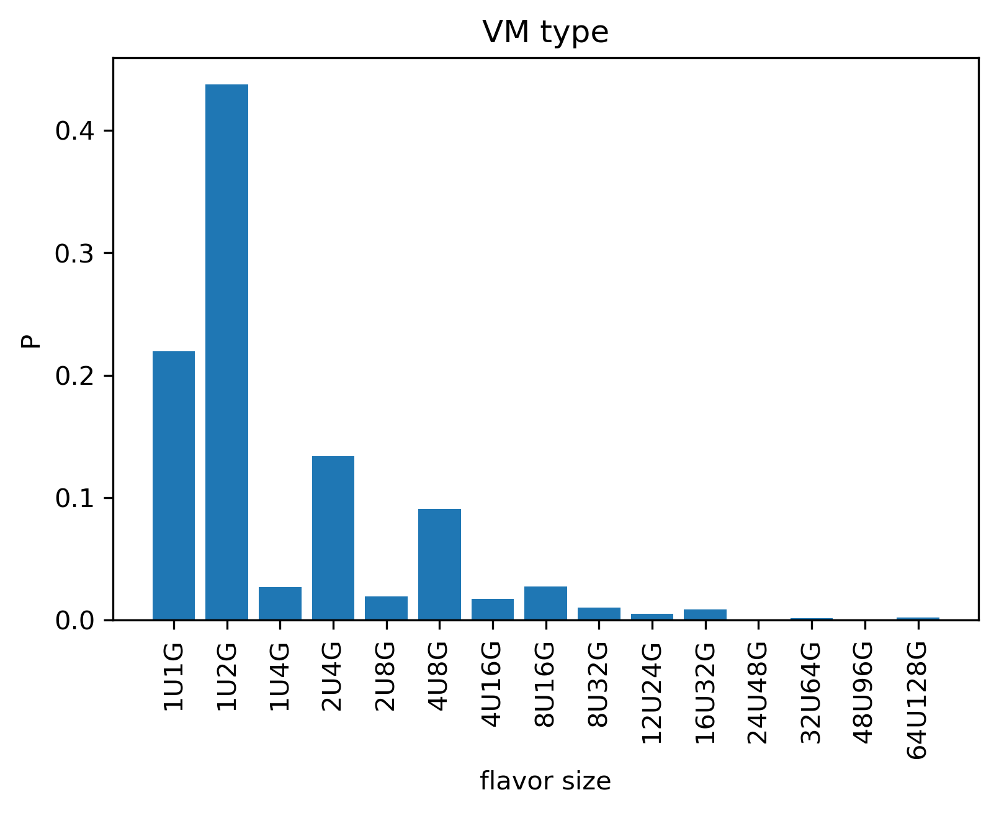

# Dataset 
Our VMAgent collects the **real scheduling data in huawei cloud** for one month.
The [dataset](https://github.com/mail-ecnu/VMAgent/blob/master/vmagent/data/dataset.csv) is placed in our repository.

## Statistical Analysis
The statsical information of the dataset is listed below.

| Number of  VM types | Number of  creation requests | Number of  deletion requests | Time duration | Server location |
|---------------------|------------------------------|------------------------------|---------------|-----------------|
| 15                  | 125430                       | 116313                       | 30 Days       | East China      |

To gain better understanding of the cpu and memory distribution, we plot the histograms of the cpu and memory.

More than 2/3 requests only consumes 1U and less than 2G.
We also plot the statiscs of the (cpu, mem) request:

The 1U1G,1U2G, 2U4G and 4U8G constitues the main body of the requests.

We also visualize the dynamic of virtual machine during the month: 

Although there exists deletion request, the number of alive virtual machines increses from 0 to more than 8000.
It should be noted that, even in the one month, the VM's dynamic is highly related to the time.
`Increase, Flux, Increase, Flux` happens through the one month.

We also visualize the allocated cpu and memory dynamic above.
They can be helpful in constructing domain knowledge.

## Naive Baselines performance
Another way to describe the dataset is measuring performance of naive baselines in the dataset.
We adopt First-Fit and Best-Fit as the naive baselines and conduct experiments on different settings.

### Fading 
We conduct fading experiments with 5, 20, 50 servers and each server has 40 cpu and 90 memeory.

### Recovering
We conduct fading experiments with 5, 20, 50 servers and each server has 40 cpu and 90 memeory.