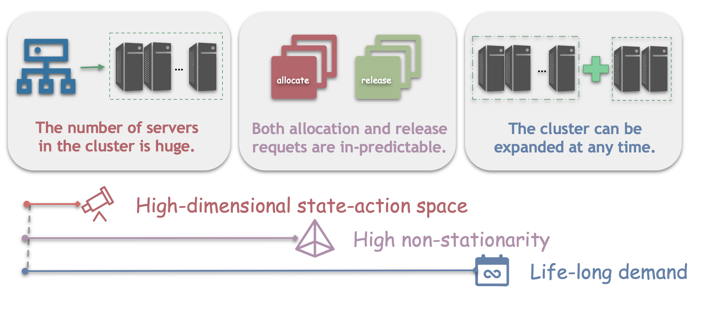

# Scenarios
Our VMAgent provides multiple virtual machine scheduling scenarios in the practical cloud computing.
These scenarios differ from each other on the cluster's feature and the request's feature.
Moreover, these different scenarios also pose different perspective difficluties on the reinforcement learning methods.
We summarize the cluster features, request features and their corresponding difficuluties on RL below.

## Scheduling 
The virtual machine scheduling problem can be divided into three main components: Request Sequence, Cluster and Scheduler.

Breifly speaking, a number of users request virtual machine resources and proposes requests sequentially.
Each time the scheduler observes a request, it will check the cluster and find a server in the cluster to handle the request.
The server then allocate corresponding resources for the request.
When there are no server in the cluster can handle the request, the scheduler will be terminated.
The scheduler is designed to avoid termination.

## Cluster 
For a cluster, it includes $N$ servers. 
The server often has its attribute $(c, m, numas)$ where the $numas$ is the number of numa it has and the $c$ and $m$ are the number of the cpu and memory each numa has. 

## Request
